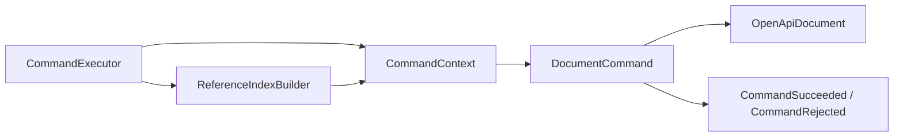

# `studio-core` architecture

Language: **English** · [Русский](../../ru/architecture/core.md)

Status: implemented core architecture as of 2026-07-30.

The source code is located under
`studio-core/src/main/java/ru/luttsev/studio/core`.

## Purpose

`studio-core` is the independent domain core of the editor. It represents an
OpenAPI document in memory and implements operations that do not require
Spring, HTTP, YAML/JSON, a file system, or a database.

The module is responsible for:

- the document domain model;
- new-document creation;
- object addressing and traversal;
- local `$ref` handling and reference usage indexing;
- semantic validation;
- atomic editing commands.

The module is not responsible for:

- YAML/JSON parsing and serialization;
- validation against a version-specific OpenAPI schema;
- REST DTOs and controllers;
- persistence, transactions, and concurrent access;
- frontend state and rendering.

## Core invariants

1. Core does not depend on frameworks or infrastructure.
2. The OpenAPI format is normalized at the input boundary, not inside business
   logic.
3. Models are mutable because documents are edited interactively.
4. Collections are initialized as empty by default and preserve order where it
   matters to the editor.
5. Unknown data is preserved rather than discarded.
6. An expected command rejection is returned as data, not thrown as an
   exception.
7. Independent model, result, and support types live in separate files.

## Package structure

| Package | Purpose |
| --- | --- |
| `document` | Factory and parameters for creating a new document |
| `model` | Document root, components, and thematic OpenAPI models |
| `model.value` | Arbitrary JSON/YAML-compatible values |
| `navigation` | `DocumentPath`, lookup, and full graph traversal |
| `reference` | Reference resolution and mutation |
| `reference.index` | Index of `$ref` sources and targets |
| `validation` | Context, results, profiles, and rules |
| `command` | Command execution and concrete editing operations |

## Domain model

### Document root

`OpenApiDocument` contains the OpenAPI version, `Info`, servers, paths,
webhooks, components, security requirements, tags, and external
documentation. The model can also store agreed fields from a newer standard,
such as `self`.

`Components` contains named collections of reusable schemas, responses,
parameters, examples, request bodies, headers, security schemes, links,
callbacks, and path items.

An operation's `responses` field is represented by the `Responses` model.
The model stores response entries by `ResponseKey` and extends
`ExtensibleObject`, so fields such as `x-*` extensions remain attached to the
Responses Object instead of being moved to the operation.

Most models extend `ExtensibleObject`. Its `additionalFields` map stores
unknown fields and `x-*` extensions as `DocumentValue`.

### Schema

`Schema` is a sealed interface with two implementations:

- `SchemaDefinition` is a regular JSON Schema object with types, constraints,
  properties, composition, `$ref`, and additional keywords;
- `LogicalSchema` is a literal boolean schema, `true` or `false`.

There is no separate Java subclass for each JSON type. All of the following
components are represented by `SchemaDefinition`; only `types` differs:

```yaml
components:
  schemas:
    StringTest:
      type: string
    BooleanTest:
      type: boolean
    ArrayTest:
      type: array
```

`JsonType` contains `NULL`, `BOOLEAN`, `OBJECT`, `ARRAY`, `NUMBER`, `STRING`,
and `INTEGER`. Nullable semantics can therefore be represented as a type set,
for example `[STRING, NULL]`, rather than as a universal separate flag.

`SchemaDefinition.examples` is a list. Unknown schema keywords are stored
separately in `additionalKeywords`.

### DocumentValue

`DocumentValue` represents an arbitrary document value, not a schema. For
example:

```yaml
example:
  id: 42
  roles:
    - admin
    - editor
  active: true
```

This is represented by an `ObjectValue` containing `NumberValue`,
`ArrayValue`, `StringValue`, and `BooleanValue`. The complete set of variants
is `NullValue`, `BooleanValue`, `NumberValue`, `StringValue`, `ArrayValue`,
and `ObjectValue`.

The type is used for examples, defaults, enum and const values, extensions,
and unknown fields.

### Inline object or `$ref`

OpenAPI fields that accept either an inline object or a Reference Object use
`ReferenceOr<T>`:

- `InlineObject<T>` contains the object itself;
- `ReferenceObject<T>` contains a `UriReference`, summary, description, and
  extensions.

Objects with a mutable `$ref` implement `ReferenceHolder`. This allows
`ReferenceEditor` to update references without knowing the concrete model
type.

## Document creation

`OpenApiDocumentFactory.create(NewDocumentParameters)` creates the minimum
document needed for editing:

- stores the selected OpenAPI version;
- creates `Info` with a title and API version;
- creates empty `Paths` and `Components`.

The calling layer chooses the default OpenAPI value. For the first release it
is `OpenApiVersion.V3_1_2`. Core also contains the named values `V3_0_4` and
`V3_2_0`, but their presence does not imply complete validation or
serialization support.

## Navigation

`DocumentPath` is an immutable object address represented as a JSON Pointer.
For example:

```text
/paths/~1users~1{id}/get/responses/200
```

Here `~1` encodes `/` and `~0` encodes `~` according to JSON Pointer. The class
can parse a pointer and a URI fragment, construct child and parent paths,
check prefixes, and replace a prefix.

`DocumentNavigator` provides:

- `find` for locating an object by path, optionally checking the expected Java
  type;
- `walk` for traversing the entire document as a sequence of `DocumentEntry`
  values.

Navigation unwraps `InlineObject` transparently. Traversal is protected
against identity cycles in the mutable graph.

`DocumentNodeRegistry` describes model child fields. Its mappings are split
into `RootMappings`, `PathMappings`, `PayloadMappings`, `SecurityMappings`,
and `SchemaMappings`. When a new model branch is added, its fields must be
registered here; otherwise, the navigator, reference index, and some
validation rules will not see it.

`Map`, `Iterable`, `ObjectValue`, `ArrayValue`, and `additionalFields` are
handled by the common traversal mechanism.

## References

`ReferenceResolver` resolves local URI fragments through
`DocumentNavigator`. It returns the sealed `ReferenceResolution<T>` result:

- `ResolvedReference<T>` contains the value and its `DocumentPath`;
- `UnresolvedReference<T>` contains a `ReferenceFailure`.

Failure reasons distinguish an invalid reference, external reference,
unsupported anchor, missing target, and type mismatch. External files and
anchors are not resolved yet, but the original `UriReference` remains in the
model.

`ReferenceIndexBuilder` traverses the document and indexes `UriReference`
values located specifically in a `$ref` field. `ReferenceIndex` can:

- return all resolved and unresolved usages;
- find a usage by source path;
- find references to a particular target or its subtree;
- find references originating inside a subtree.

`ReferenceEditor.replaceTargetPrefix` updates local references when an object
is renamed. It first verifies that every reference owner is available and
only then applies changes.

At the current stage, the index is rebuilt before each command execution.

## Validation

`ValidationRule` is an individual semantic check:

```java
List<ValidationIssue> validate(ValidationContext context);
```

`DocumentValidator` selects rules through `ValidationRulesProvider`, creates a
shared `ValidationContext`, and collects issues into `ValidationResult`.
`ValidationIssue` contains a stable `ValidationCode`, severity, message, and
`DocumentPath`.

The current `OpenApi31ValidationRulesProvider` applies to `3.1.x` and includes:

- `ReferenceIntegrityRule`;
- `OperationIdUniquenessRule`;
- `PathTemplateRule`;
- `ParameterUniquenessRule`;
- `AmbiguousPathRule`;
- `TagUniquenessRule`;
- `SecurityRequirementRule`;
- `LinkIntegrityRule`;
- `CallbackExpressionRule`;
- `EncodingContextRule`;
- `DiscriminatorRule`;
- `ServerRule`.

These checks validate document relationships and semantics. YAML/JSON
conformance to the official structural schema for a particular version belongs
in `studio-openapi`.

To add a rule:

1. Create a standalone `ValidationRule` implementation in `validation.rule`.
2. Use stable codes and precise `DocumentPath` values.
3. Add the rule to the corresponding `ValidationRulesProvider`.
4. Cover both valid and invalid scenarios with tests.

## Commands

`DocumentCommand` defines `execute(CommandContext)`. Before every invocation,
`CommandExecutor` builds a fresh `ReferenceIndex` and supplies the command
with:

- the document being edited;
- `DocumentNavigator`;
- the current `ReferenceIndex`;
- `ReferenceEditor`.



A successful result contains paths to the changed parts of the document. An
expected rejection contains a `CommandIssue` with a stable code, a primary
path, and related paths when needed.

Implemented commands:

- components: `RenameComponentCommand`, `DeleteComponentCommand`;
- schemas: `AddSchemaCommand`, `AddSchemaPropertyCommand`,
  `RemoveSchemaPropertyCommand`;
- paths: `AddPathCommand`, `RemovePathCommand`;
- operations: `AddOperationCommand`, `RemoveOperationCommand`.

### Atomicity

A command must check every expected rejection reason before the first
mutation. If it returns `CommandRejected`, the document remains unchanged.
Exceptions are for programming contract violations, not normal user errors.

Renaming a component preserves its position in the map and updates local
references to both the component itself and elements inside its subtree.
External references are not changed.

Deletion is rejected when resolved local `$ref` values outside the removed
subtree point into that subtree. References located within the same removed
subtree do not prevent deletion. There is no force mode yet.

Add commands create new mutable model objects inside the command. This
prevents a calling layer from retaining a reference and silently mutating an
object after it has been added.

To add a command:

1. Define the smallest user action it represents.
2. Define its paths and stable rejection reasons.
3. Check every precondition before mutation.
4. Account for external usages of a subtree being removed or renamed.
5. Return precise changed paths.
6. Add success, conflict, and atomicity tests.

## State and performance

Core works with one complete document in memory. Navigation and the reference
index operate on this graph. This is a deliberate first-release boundary.

A persistence layer may store the whole document or convert it into another
representation, but domain classes must not gain ORM annotations or repository
dependencies. Incremental reference indexing, partial loading, and graph
storage should be considered only after profiling.

## Testing

Tests are located under `studio-core/src/test/java` and use JUnit Jupiter.

Verify the core:

```powershell
.\gradlew.bat :studio-core:test
```

Verify all modules:

```powershell
.\gradlew.bat test
```

## Not part of core yet

- undo/redo stack;
- command history and command serialization;
- force mode;
- document sessions and optimistic locking;
- resolution of external files and JSON Schema anchors;
- version-specific parser and serializer;
- persistence and cross-request caching.
