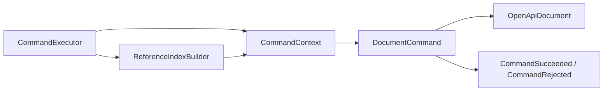

# Архитектура `studio-core`

Язык: **Русский** · [English](../../en/architecture/core.md)

Статус: реализованная архитектура ядра на 2026-08-01.

Исходный код находится в
`studio-core/src/main/java/ru/luttsev/studio/core`.

## Назначение

`studio-core` — независимое доменное ядро редактора. Оно представляет
OpenAPI-документ в памяти и реализует операции, которым не нужны Spring,
HTTP, YAML/JSON, файловая система или база данных.

Модуль отвечает за:

- доменную модель документа;
- создание нового документа;
- адресацию и обход объектов;
- локальные `$ref` и индекс их использований;
- семантическую валидацию;
- атомарные команды редактирования.

Модуль не отвечает за:

- парсинг и сериализацию YAML/JSON;
- проверку документа по version-specific OpenAPI schema;
- REST DTO и контроллеры;
- хранение, транзакции и конкурентный доступ;
- frontend-состояние и отображение.

## Основные инварианты

1. Core не зависит от framework и инфраструктуры.
2. Формат OpenAPI нормализуется на входной границе, а не внутри бизнес-логики.
3. Модели изменяемы, потому что документ редактируется интерактивно.
4. Коллекции по умолчанию создаются пустыми и сохраняют порядок там, где он
   важен для редактора.
5. Неизвестные данные сохраняются, а не отбрасываются.
6. Ожидаемый отказ команды возвращается как данные, а не как исключение.
7. Самостоятельные model/result/support типы находятся в отдельных файлах.

## Структура пакетов

| Пакет | Назначение |
| --- | --- |
| `document` | Фабрика и параметры создания нового документа |
| `model` | Корень документа, components и тематические модели OpenAPI |
| `model.value` | Произвольные JSON/YAML-совместимые значения |
| `navigation` | `DocumentPath`, поиск и полный обход графа |
| `reference` | Разрешение и изменение ссылок |
| `reference.index` | Индекс источников и целей `$ref` |
| `validation` | Контекст, результаты, profiles и rules |
| `command` | Исполнение команд и конкретные операции редактирования |

## Доменная модель

### Корень документа

`OpenApiDocument` содержит версию OpenAPI, `Info`, servers, paths, webhooks,
components, security requirements, tags и external documentation. Также модель
уже умеет хранить согласованные поля более нового стандарта, например `self`.

`Components` содержит именованные коллекции переиспользуемых схем, responses,
parameters, examples, request bodies, headers, security schemes, links,
callbacks и path items.

Поле `responses` операции представлено моделью `Responses`. Она хранит записи
ответов по `ResponseKey` и наследует `ExtensibleObject`, поэтому поля вроде
`x-*` extensions остаются на уровне Responses Object и не переносятся в
операцию.

Для security на уровне операции сохраняется присутствие поля, потому что его
отсутствие и пустой массив имеют в OpenAPI разный смысл. Новая `Operation`
наследует корневую security и возвращает `hasSecurityOverride() == false`.
Вызов `setSecurity` или изменение списка из `getSecurity` задаёт override,
даже если список пуст. `inheritSecurity()` удаляет override и возвращает
наследование. Сам список остаётся изменяемым и никогда не равен `null`, как и
остальные коллекции core.

Большинство моделей наследует `ExtensibleObject`. Его `additionalFields`
хранит неизвестные поля и `x-*` extensions в виде `DocumentValue`.

### Schema

`Schema` — sealed interface с двумя реализациями:

- `SchemaDefinition` — обычный объект JSON Schema с types, constraints,
  properties, composition, `$ref` и дополнительными keywords;
- `LogicalSchema` — литеральная boolean schema `true` или `false`.

Для каждого JSON-типа не создаётся отдельный Java-подкласс. Все эти компоненты
представлены `SchemaDefinition`, различается только `types`:

```yaml
components:
  schemas:
    StringTest:
      type: string
    BooleanTest:
      type: boolean
    ArrayTest:
      type: array
```

`JsonType` содержит `NULL`, `BOOLEAN`, `OBJECT`, `ARRAY`, `NUMBER`, `STRING` и
`INTEGER`. Поэтому nullable-семантика хранится как набор типов, например
`[STRING, NULL]`, а не как отдельный универсальный флаг.

`SchemaDefinition.examples` — список. Неизвестные schema keywords сохраняются
отдельно в `additionalKeywords`.

### DocumentValue

`DocumentValue` представляет произвольное значение документа, а не схему.
Например, YAML:

```yaml
example:
  id: 42
  roles:
    - admin
    - editor
  active: true
```

представляется `ObjectValue`, внутри которого находятся `NumberValue`,
`ArrayValue`, `StringValue` и `BooleanValue`. Полный набор вариантов:
`NullValue`, `BooleanValue`, `NumberValue`, `StringValue`, `ArrayValue` и
`ObjectValue`.

Этот тип используется для examples, defaults, enum/const values, extensions и
неизвестных полей.

### Inline object или `$ref`

Поля OpenAPI, допускающие либо встроенный объект, либо Reference Object,
используют `ReferenceOr<T>`:

- `InlineObject<T>` содержит сам объект;
- `ReferenceObject<T>` содержит `UriReference`, summary, description и
  extensions.

Объекты, у которых есть изменяемый `$ref`, реализуют `ReferenceHolder`. Это
позволяет `ReferenceEditor` обновлять ссылки без знания конкретного типа модели.

## Создание документа

`OpenApiDocumentFactory.create(NewDocumentParameters)` создаёт минимально
пригодный к редактированию документ:

- записывает выбранную OpenAPI version;
- создаёт `Info` с title и API version;
- создаёт пустые `Paths` и `Components`.

Значение OpenAPI по умолчанию выбирает вызывающий слой. Для первого релиза это
`OpenApiVersion.V3_1_2`. Core также содержит именованные значения `V3_0_4` и
`V3_2_0`, но само их наличие не означает готовую валидацию или сериализацию.

## Навигация

`DocumentPath` — неизменяемый адрес объекта в виде JSON Pointer. Пример:

```text
/paths/~1users~1{id}/get/responses/200
```

Здесь `~1` кодирует `/`, а `~0` кодирует `~` согласно JSON Pointer. Класс умеет
разбирать pointer и URI fragment, строить child/parent, проверять prefix и
заменять его.

`DocumentNavigator` предоставляет:

- `find` — поиск объекта по пути, в том числе с проверкой ожидаемого Java-типа;
- `walk` — последовательный обход всего документа как `DocumentEntry`.

При навигации `InlineObject` прозрачно разворачивается. Обход защищён от
identity cycles в изменяемом графе.

Дочерние поля моделей описывает `DocumentNodeRegistry`. Маппинги разделены на
`RootMappings`, `PathMappings`, `PayloadMappings`, `SecurityMappings` и
`SchemaMappings`. При добавлении новой model-ветки нужно зарегистрировать её
поля здесь, иначе navigator, reference index и часть validation rules её не
увидят.

`Map`, `Iterable`, `ObjectValue`, `ArrayValue` и `additionalFields`
обрабатываются общим механизмом.

## Ссылки

`ReferenceResolver` разрешает локальные URI fragments через
`DocumentNavigator`. Результат — sealed `ReferenceResolution<T>`:

- `ResolvedReference<T>` содержит значение и его `DocumentPath`;
- `UnresolvedReference<T>` содержит `ReferenceFailure`.

Различаются причины: invalid reference, external reference, unsupported anchor,
target not found и type mismatch. Внешние файлы и anchors пока не разрешаются,
но исходный `UriReference` остаётся в модели.

`ReferenceIndexBuilder` обходит документ и индексирует значения
`UriReference`, расположенные именно в поле `$ref`. `ReferenceIndex` позволяет:

- получить все resolved и unresolved usages;
- найти usage по source path;
- найти ссылки на конкретную цель или её subtree;
- найти ссылки, исходящие из subtree.

`ReferenceEditor.replaceTargetPrefix` обновляет локальные ссылки при
переименовании объекта. Сначала проверяется доступность всех владельцев ссылок,
и только затем выполняются изменения.

На текущем этапе индекс строится заново перед исполнением каждой команды.

## Валидация

`ValidationRule` — отдельная семантическая проверка:

```java
List<ValidationIssue> validate(ValidationContext context);
```

`DocumentValidator` выбирает правила через `ValidationRulesProvider`, создаёт
общий `ValidationContext` и собирает issues в `ValidationResult`.
`ValidationIssue` содержит стабильный `ValidationCode`, severity, сообщение и
`DocumentPath`.

Текущий `OpenApi31ValidationRulesProvider` применяется к `3.1.x` и включает:

- `ReferenceIntegrityRule`;
- `OperationIdUniquenessRule`;
- `PathTemplateRule`;
- `ParameterUniquenessRule`;
- `AmbiguousPathRule`;
- `TagUniquenessRule`;
- `SecurityRequirementRule`;
- `LinkIntegrityRule`;
- `CallbackExpressionRule`;
- `EncodingContextRule`;
- `DiscriminatorRule`;
- `ServerRule`.

Это проверки связей и смысла документа. Соответствие YAML/JSON официальной
структурной схеме конкретной версии должно проверяться в `studio-openapi`.

Добавление правила:

1. Создать самостоятельную реализацию `ValidationRule` в `validation.rule`.
2. Использовать стабильные codes и точные `DocumentPath`.
3. Добавить правило в соответствующий `ValidationRulesProvider`.
4. Покрыть корректный и ошибочный сценарии тестами.

## Команды

`DocumentCommand` содержит `execute(CommandContext)`. `CommandExecutor` перед
каждым вызовом строит свежий `ReferenceIndex` и передаёт команде:

- редактируемый документ;
- `DocumentNavigator`;
- текущий `ReferenceIndex`;
- `ReferenceEditor`.



Успех содержит пути изменённых частей документа. Ожидаемый отказ содержит
`CommandIssue` со стабильным code, основным path и, при необходимости,
related paths.

Реализованные команды:

- components: `RenameComponentCommand`, `DeleteComponentCommand`;
- schemas: `AddSchemaCommand`, `AddSchemaPropertyCommand`,
  `RemoveSchemaPropertyCommand`;
- paths: `AddPathCommand`, `RemovePathCommand`;
- operations: `AddOperationCommand`, `RemoveOperationCommand`.

### Атомарность

Команда должна проверить все ожидаемые причины отказа до первой мутации. Если
она возвращает `CommandRejected`, документ остаётся без изменений.
Исключения предназначены для нарушений программного контракта, а не для
обычных пользовательских ошибок.

Переименование component сохраняет позицию записи в map и обновляет локальные
ссылки как на сам component, так и на элементы внутри его subtree. Внешние
ссылки не изменяются.

Удаление запрещено, если на удаляемый subtree снаружи существуют разрешённые
локальные `$ref`. Ссылки, находящиеся внутри того же удаляемого subtree, не
мешают удалению. Force-режима сейчас нет.

Add-команды создают новые изменяемые model objects внутри команды. Это не даёт
вызывающему слою незаметно продолжать менять уже добавленный объект через
сохранённую ссылку.

Добавление команды:

1. Сформулировать минимальное пользовательское действие.
2. Определить paths и стабильные причины отказа.
3. Выполнить все preconditions до мутации.
4. Учесть внешние usages удаляемого или переименовываемого subtree.
5. Вернуть точные changed paths.
6. Добавить тесты успеха, конфликта и атомарности.

## Состояние и производительность

Core работает с одним полным документом в памяти. Навигация и индекс ссылок
строятся поверх этого графа. Это осознанная граница первого релиза.

Persistence layer может сохранять документ целиком или преобразовывать его в
другую форму, но доменные классы не должны получать ORM-аннотации или
repository-зависимости. Инкрементальный reference index, частичная загрузка и
графовое хранилище рассматриваются только после профилирования.

## Тестирование

Тесты находятся в `studio-core/src/test/java` и используют JUnit Jupiter.

Проверка ядра:

```powershell
.\gradlew.bat :studio-core:test
```

Проверка всех модулей:

```powershell
.\gradlew.bat test
```

## Пока не входит в core

- undo/redo stack;
- command history и сериализация команд;
- force mode;
- document sessions и optimistic locking;
- разрешение внешних файлов и JSON Schema anchors;
- version-specific parser/serializer;
- persistence и кэширование между запросами.
